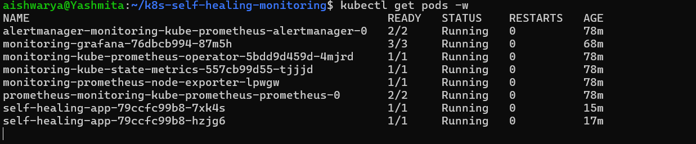
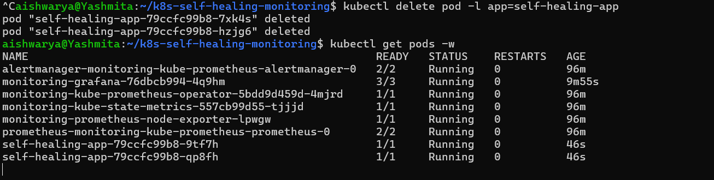
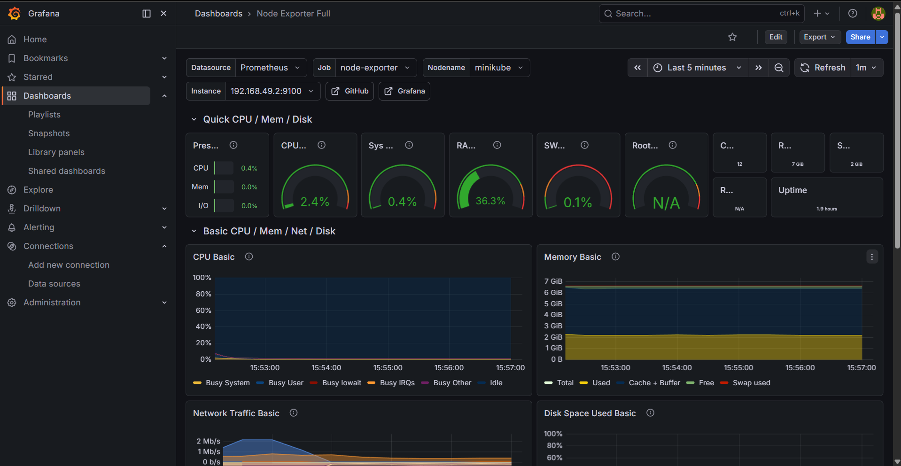
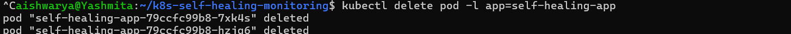
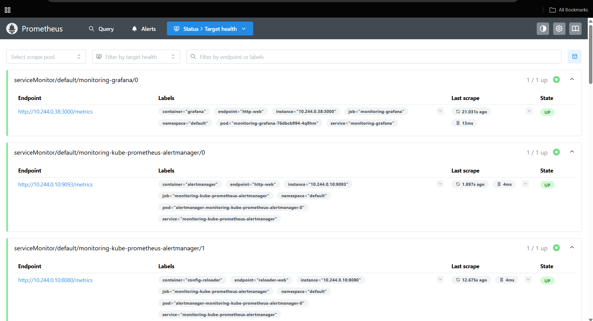

# Kubernetes Self-Healing Monitoring System

## Project Overview

This project demonstrates a self-healing application deployed on Kubernetes with monitoring and visualization using Prometheus and Grafana. It highlights how containerized applications can automatically recover from failures while providing real-time system metrics.

## Tech Stack

* Docker
* Kubernetes (Minikube)
* Prometheus
* Grafana
* Python (Flask)

## Features

* Containerized Flask application
* Deployment on Kubernetes cluster
* Self-healing using ReplicaSets (automatic pod recovery)
* Monitoring using Prometheus
* Visualization using Grafana dashboards
* Failure simulation and recovery

## Architecture

User requests are routed through a Kubernetes Service to application pods.
Prometheus collects metrics from the cluster and Grafana visualizes them.

## Setup Instructions

### Start Minikube

```bash
minikube start
```

### Build Docker Image

```bash
docker build -t <your-dockerhub-username>/self-healing-app:latest .
```

### Push Image

```bash
docker push <your-dockerhub-username>/self-healing-app:latest
```

### Deploy to Kubernetes

```bash
kubectl apply -f k8s/
```

### Verify Deployment

```bash
kubectl get pods
```

### Access Application

```bash
kubectl port-forward svc/self-healing-service 8080:80
```

Open http://localhost:8080

### Access Grafana

```bash
kubectl port-forward svc/monitoring-grafana 3000:80
```

Open http://localhost:3000

Default credentials:

* Username: admin
* Password: admin

### Import Dashboard

* Go to Import Dashboard
* Enter ID: 1860
* Select Prometheus data source

## Screenshots

### Kubernetes Pods



### Application



### Grafana Dashboard



### Self-Healing Demonstration



### Prometheus



## Self-Healing Test

```bash
kubectl delete pod -l app=self-healing-app
```

Kubernetes automatically recreates the pod.

## Key Learnings

* Kubernetes self-healing and pod lifecycle
* Monitoring with Prometheus
* Metrics visualization with Grafana
* Debugging deployment and image issues
* Container orchestration fundamentals
